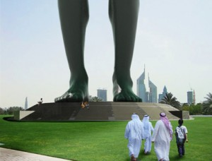

<table border="0">
  <tr>
    <td>
      
    </td>
    
    <td>
      <blockquote>
        

          &#8216;MODERN ARCHITECTURE IS STILL IN ITS INFANCY. WE BELEIVE THERE IS UNLIMITED POTENTIAL IN THIS FIELD WITH REGARD TO HOUSING AS WELL AS PUBLIC SPACE.&#8217;
        

      </blockquote>
    </td>
    
    <td>
    </td>
  </tr>
</table>

##### Visiondivision is the creative home of the offbeat Anders & Ulf and is quickly becoming Stockholm’s answer to neighbouring Copenhagen’s Bjarke Ingels Group. Their infectious brand of inventive positive architecture has already gained international patronage and a popular cult following. They join me now in interview.

#### Please tell us a little about who you are, how your partnership formed and of your experiences prior to its formation?

We are both from Stockholm, but we met when we started at the university in Gothenburg. It was during this time we did our first projects together, both school projects and competitions. We quickly understood that we both had the same syndrome; an almost autistic urge to be creative and explore the field of architecture. During our school years we probably did about 80 projects together, we didn’t even sit in the same atelier; so we used to make projects in the school cafeteria, in the corridors and at the lunch restaurants, it was very spontaneous and joyful.  
Later, we decided to get outside of Sweden to broaden our architectural and personal horizons. Even though we were often at opposites sides of the world from each other we kept in contact, mainly via msn. Coming home after a couple of years we realized it was time to form a solid office out of all this aspiration and ideas that we had, so visiondivision was founded.

<table border="0">
  <tr>
    <td>
      
    </td>
    
    <td>
      <blockquote>
        

          &#8216;ARCHITECTURE IS NOT ALWAYS ABOUT REDUCTION. FOR US, IT’S A LOT ABOUT STORYTELLING. WE WANT TO MAKE GREAT SCRIPTS SO ITS USERS CAN FORM THESE EXTRAORDINARY LIFE STORIES. WE WANT TO SHOW POTENTIALS IN THINGS, TO SHOW WHAT A BUILDING CAN BE ABOUT.’
        

      </blockquote>
    </td>
  </tr>
</table>

#### A noble cause, what have your achievements been so far?

Well, we started our career with a number of competitions. The Merchants of Venice, Bird Bridge, Pamukkale and Noble Savage, among others, won us a good deal of press attention and interest but no first prizes yet. We haven’t had a problem finding projects though and we’ll keep trying to make them as great as possible, however small they are, and hopefully show the rest of the world that visiondivision means business.

#### To complement these tantalizing unrealised projects you&#8217;re also finding a good deal of work completing smaller scale commissions. What are you currently busy with?

At the moment we&#8217;re overseeing three parallel construction sites in Stockholm, designing a branch of shoe stores on Reunion Island and hopefully building a small hotel in Colombia later this year. We&#8217;re also planning an architecture production initiated by Svensk Standard for the Nordic Culture Festival in Beijing. But we’re also working on a couple of international competitions and have high expectations for the outcome.  
We really like jumping between scales; the competitions are a great contrast to our built work which so far have belonged to the smaller category that are also extremely fun to create with relatively fast results. Our favorite &#8216;mini&#8217; so far has been a bath for an old man in Northern Sweden called the Cauldron Claw, perhaps mainly because it was great fun to incorporate an 85 year old welder in our office for two intensive weeks.  
We&#8217;ve also built a Secret Sauna and a shrine inside a mountain for a team of Bolivian miners. These small operations are a testing ground for ideas that are often transmitted into our slightly larger work. For example we have added an outside cinema for six people on the hillside behind one of the houses that we are now erecting and two caves that you can reach from separate trap doors from the two bedrooms. They become like several small projects within the overall design. It&#8217;s great fun.

<table border="0">
  <tr>
    <td>
      
    </td>
    
    <td>
      <blockquote>
        

          &#8216;THE PROJECT WAS MORE LIKE AN ARCHITECTURAL JAM BETWEEN US AND THE CLIENTS AND WE CAME IN WITH THE ATTITUDE OF RATHER PUTTING A GUITAR SOLO TO THEIR BASELINE THAN BEING A STERN CONDUCTOR.’
        

      </blockquote>
    </td>
  </tr>
</table>

#### It seems that you have a very close relationship with the clients of your built work and also that if anyone is to build one of your epics that they must also be a very special person. Giving examples, can you explain how you involve the clients, how you win their trust?

We believe all clients are special in one way or the other. And we guess we often win their trust by emphasising what is special about them in our design but also by trying to involve them in the building process. Take the South American shrine “Capilla para el tio” as an example. The project was very well received and we think it mainly depended on the fact that we did the project together with the miners. During the whole process the miners were included, not only in building the chapel but also as advisers concerning the architecture. The project was more like an architectural jam between us and the clients and we came in with the attitude of rather putting a guitar solo to their baseline than being a stern conductor. Drinking and smoking with the miners before the daily building sessions also contributed to an overall friendly atmosphere.  
Another project that is about to be built right now is the “Spröjs House” (Mullion House) which is based on the fact that the clients liked houses with mullions but expected us to give them a design without these mullions since they thought architects don&#8217;t do this kind of design anymore. We usually don&#8217;t but in this case we made an exception and instead tried to make a house with a concept based on improving the mullion fashion by making them useful in the everyday life of the client. We usually find the concept in our clients&#8217; different life stories or preferences, and these are just some examples of it.

#### It’s clear your client’s are important in defining the direction of a project but your there is also more to your inspiration. What’s your point of departure?

Our complex planet is such an amazing thing, but a lot of this mind blowing beauty and variety has been lost in the everyday life. We want to try to reconstruct this in a way, to show the richness of the world we live in, to add things that make you think and enjoy life more.  
Architecture is not always about reduction. For us, it’s a lot about storytelling. We want to make great scripts so its users can form these extraordinary life stories. We want to show potentials in things, to show what a building can be about.  
A lot of new architecture is homogenised and dull and it doesn’t offer us anything new or unexpected, we think that modern architecture is still in its infancy and that there is an unlimited potential in this field with regard to housing as well as public space.

<table border="0">
  <tr>
    <td>
      
    </td>
    
    <td>
      <blockquote>
        

          <a title="Noble Savage" href="http://www.youtube.com/watch?v=EjnEjFZSpRM" target="_blank">See Noble Savage on YouTube  </a>
        

      </blockquote>
    </td>
  </tr>
</table>

#### I quite agree but how should we tap into this field of unlimited potential? I don&#8217;t think it need require stupendous sums of money it&#8217;s more of a cultural question. Isn’t it enough to invest our buildings and public space and with a little more spirit?

We think providing novel yet practical solutions is a matter of self-confidence. We&#8217;d rather make a proposal that surprises the client than something predictable. Sometimes it works sometimes it doesn&#8217;t, but as architects we think it is our obligation to make our own diagnose and answer to the certain needs of each client. These answers, in our case, often tend to be a bit more spirited, rock ‘n roll even. Most of the time these proposals are well received, maybe because the clients are more rock ‘n roll than architects tend to think.  
When a client decides to build a new house, or indeed any project, they open their entire future for reappraisal, they think about themselves and their environment, what they want to change and they are full of hope. This can launch a state where one is more open for new ideas because the situation in itself is perhaps new and uncharted. We try to offer a bold answer to this challenge and one that the client can be proud of and feel positive about.

[nggallery id=1]
