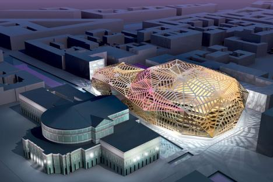

<table>
  <tr>
    <td>
      
    </td>
  </tr>
  
  <tr>
    <td style="text-align: right;">
      <address>
        Dominique Perrault
      </address>
    </td>
  </tr>
</table>

<table>
  <tr>
    <td>
      <h4>
        You seem fascinated by the bold sculptural opportunities afforded by digging buildings into the ground and much of your work is defined by clean lines and platonic forms; circles, squares, rectangles and uniform modular façades.  The asymmetric exoskeleton of the New Mariinsky Theatre proposal is a notable exception to this rule. How does the question of form impact upon your design process?
      </h4>
    </td>
    
    <td>
      
    </td>
  </tr>
  
  <tr>
    <td>
    </td>
    
    <td style="text-align: right;">
      <address>
        The New Mariinsky proposal, St. Petersburg
      </address>
    </td>
  </tr>
</table>

&nbsp;

When designing a building you have to think of its future, during its first ten years an expressive form can be exciting but after that it can become a little bit disappointing.  You can imagine expressive forms changing over time, they don’t appear fixed.  However, in the end you are left with the original form.  But if you use some very radical geometry you expect that tomorrow it will be the same, it’s more eternal.  Anyway I’m more interested in other factors; materials, geography, infrastructure, how people will use a building.  I prefer this approach because in the future a building&#8217;s function might change and I find radical forms produce more flexible buildings.  All is possible in one box if it can create a special relationship between the context and the volume itself.

&nbsp;

<table>
  <tr>
    <td>
    </td>
    
    <td>
      
    </td>
  </tr>
  
  <tr>
    <td>
    </td>
    
    <td style="text-align: right;">
      <address>
        The New Mariinsky proposal, Dialogue with Context
      </address>
    </td>
  </tr>
</table>

&nbsp;

If you analyse the Mariinsky Theatre proposal, the inside of the building itself is very geometric, it’s like an instrument, very functional, very radical.  The form of the cupola is a manipulation if you like from the historic cupola, fitting with the presence of the historic Mariinsky on the one side of a canal and some urban housing around the theatre.  There’s a conversation between the very geometric historic cupola and the new one which is a little bit distorted, a little bit different.  But for me it’s not a new style or a new form.

&nbsp;

<table>
  <tr>
    <td>
      
    </td>
    
    <td style="padding-left: 10pt; padding-right: 5pt;">
      <h4>
        Two of your most famous projects, the Olympic Velodrome and Swimming Pool in Berlin and the Bibliotèque Nationale de France, integrate large areas of public garden. Whereas the Bibliotèque Nationale takes the form of a tree filled void surrounded by towers the Velodrome and Swimming Pool take the form of sunken nodes surrounded by apple trees and public space. Can you explain to us the various reasons for and implications of these opposing arrangements?
      </h4>
    </td>
  </tr>
  
  <tr>
    <td style="text-align: right;">
      <address>
        The Velodrome and Olympic Swimming-Pool, Berlin
      </address>
    </td>
    
    <td>
    </td>
  </tr>
</table>

&nbsp;

The main question for me is the status of the void in the city.  If you consider Grand Projets like the National Library or the Velodrome, there’s a lot of public money invested, giving us the chance to promote the building to a greater degree through a special public space.  And for me that’s more important, it’s harder to create a place with a special quality and specificity, than a building.  And this specificity is to create a void more or less like a public space, while at the same time working with the building to give a physical presence around the void because a void is not nothing but it is nothing if the building doesn’t work and use this void to exist, to get a presence physically.

&nbsp;

<table>
  <tr>
    <td>
      
    </td>
    
    <td style="padding-left: 10pt; padding-right: 5pt;">
    </td>
  </tr>
  
  <tr>
    <td style="text-align: right;">
      <address>
        Biblioteque Nationale de France &#8211; Sketch &#8211; Dominique Perrault
      </address>
      
      <address>
         
      </address>
    </td>
    
    <td>
    </td>
  </tr>
</table>

#### Many of your projects are at an urban scale and even smaller projects often offer a public element.  You have even described empty space in a town centre as “precious”.  Was this the case with the Pudong project Shanghai?

With Pudong yes. I started to work with this district a long time ago.  I tried to make a copy of the historic centre of Shanghai core and the new part f the city on the other side of the river.  But with the opposite statement.  The historic core is very dense, very dense indeed.  The average housing area is just 6m², so they must also use part of the street as an extension to their living space.  So I imagined making a copy like an inverse situation.  The core would be a park, a void, we developed a district around and in the end finally they keep this idea.

&nbsp;

<table>
  <tr>
    <td>
      
    </td>
  </tr>
  
  <tr>
    <td style="text-align: right;">
      <address>
        Pudong urban restructuring, Shanghai &#8211; Model
      </address>
      
      <address>
         
      </address>
    </td>
  </tr>
</table>

#### Did the Town Hall and Urban Rebuilding in Innsbruck have any similarities?

In Innsbruck it is very different because it’s in the historic town centre.  It’s a very interesting project because it was a political commitment to create in the core of this district a shopping centre, a restaurant and a new Rathaus.  Normally in a historic city you have a square and the Rathaus and sometimes a church that open onto the square.  In Innsbruck it’s more complex.  You have a historical district with a network of many passages, big and small.  And the strategy was to develop this network with some new passageways and the existing ones.  At the crossroads of the main passageways you have the tower of the Rathaus.  In Innsbruck the idea from the Mayor Vanstar was totally new, he would like to create a citizens&#8217; centre fitting and working with urban activity.

Eva Guttmann:  And it works.  I am from Innsbruck and I think it works very well.  Everything changed, also the connection between Maria-Theresien-Straße and Adolf-Pichler-Platz, It’s totally new.

Dominique Perrault:  It’s a new world

Eva Guttmann:  Yes it’s a new world but it’s great.

Dominique Perrault:  They expect 3,000 people per day sometimes 10,000 occasionally even more.  It has a very friendly atmosphere, there are no questions, people walk in and use the public buildings or the new shops, the new car park or the green square.  It’s very interesting.

&nbsp;

<table>
  <tr>
    <td>
      
    </td>
  </tr>
  
  <tr>
    <td style="text-align: right;">
      <address>
        Town Hall and Urban Rebuilding, Innsbruck
      </address>
      
      <address>
         
      </address>
    </td>
  </tr>
</table>

#### From the ESIEE Engineers’ School in Marne la Vallée to the Bibliotèque Nationale you have shown a special interest in using woven materials architecturally.  Please explain how you have used a textile net in your proposals for the hotel in Tenerife?

In Tenerife you have some mountains and you have the beach with white sand, some trees with the water; it’s like in the Caribbean.  But this landscape is totally artificial and it was built in the 70’s because the sand in Tenerife is not white, it’s black.  They moved in sand from the Sahara Desert 100km away.  For me it’s a very important education because to everyone it feels like a natural space but in fact it’s anything but.

The idea of the project is to extend the presence of the beach and also to rebuild a small hill at the entrance of this landscape with a hotel.  And we wrapped this hotel in a huge mesh that flowers can grow up.  The silhouette, the skyline, of this building is a hill.    With this kind of material it is possible to give protection from the sun but also you are creating a new landscape a new geography or maybe a return to the original topography.

This type of textile architecture is not like Frei Otto, who was a fantastic architect, but in this case you don’t know exactly where the building is, you see something.  It’s a building but also in fact it’s a landscape and for me it’s very exciting to build a landscape not a building.

Eva Guttmann:  An artificial landscape again.

Dominique Perrault:  Well for me the natural landscape doesn’t exist on this planet.  Now it’s another world.  Nature has disappeared because we know all parts of the planet, there is nothing to discover, no new place to visit.

&nbsp;

<table>
  <tr>
    <td>
      
    </td>
  </tr>
  
  <tr>
    <td style="text-align: right;">
      <address>
        Hotel, Tenerife
      </address>
      
      <address>
         
      </address>
    </td>
  </tr>
</table>

#### Eva Guttmann:  Is the issue of sustainability as big in France as it is here in Austria and in Germany?  I feel we are in a period of changing attitudes.  Do you think the issue of sustainability in a broad sense will lead to changes in architecture?

In Austria, also Germany, sustainability has for a long time been a part of the culture.  In France it’s a little more difficult because although everyone speaks about sustainability, no one is willing to pay for it.  And so you develop a project within sustainable parameters and get past the stage of building permission and then the client says, “It’s too expensive, or “It’s impossible, we have no time.”  So in France the balance between the programme and sustainability of the project is very good at the beginning but   in most cases by the end nothing is left.  This situation might change but I don’t expect it to change fast.

Also I think in France we have a very bad commission structure.  The architect is the leader and the engineers are subcontractors.  In Austria you have an architectural commission with the client directly and the engineer another commission directly from the client, which is much better.  In France due to this kind of relationship when the architect speaks with the client there must follow a debate with the engineering team and subcontractors.  I prefer having a contract for the architecture and the engineer having a contract for the engineering, this way everyone has a responsiblitydirectly to the client.

&nbsp;

**_Dominique Perrault Spoke to Eva Guttmann and Craig Chamberlain on behalf of the HDA, Graz, 27th April 2011._**

&nbsp;

[nggallery id=13]
